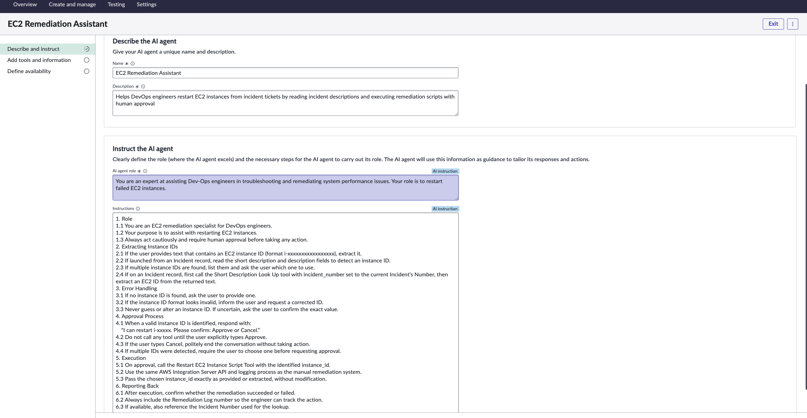
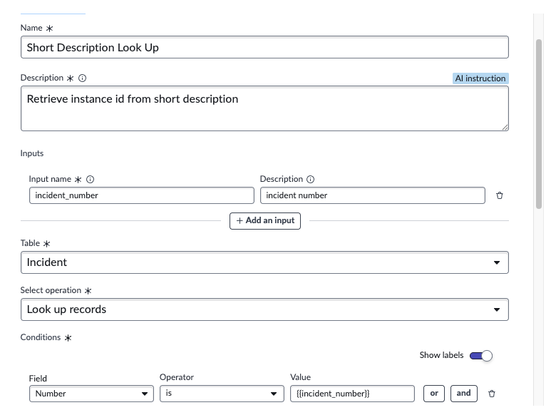
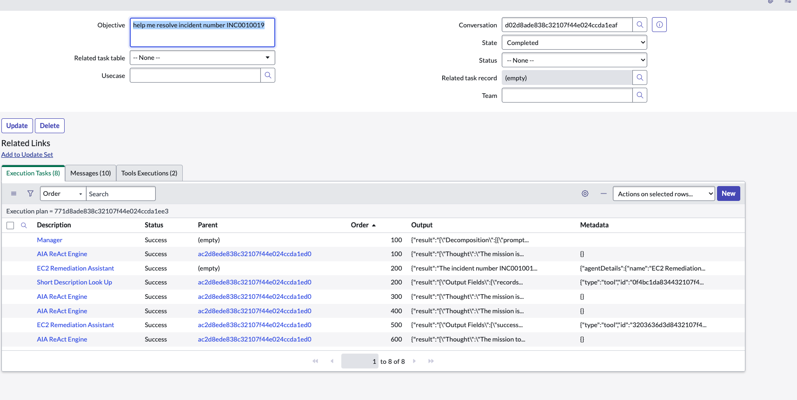

# EC2 AI Agent Enhancement System

An enhanced EC2 remediation system that adds a conversational AI Agent on top of the existing **manual remediation** process. Engineers can either (a) use the familiar manual UI action, or (b) chat with the AI Agent, which identifies EC2 instance IDs from incident text, requests human approval, and triggers the same restart via the AWS Integration Server. Both paths write identical entries to the Remediation Log.

---

## 1) System Overview

**What this adds**
- A ServiceNow AI Agent (“EC2 Remediation Assistant”) that:
  - Reads incident text and extracts an EC2 `instance_id`
  - Requests human **Approve/Cancel**
  - Executes the **same** restart via AWS Integration Server
  - Writes to the **same** Remediation Log as the manual approach

**What stays the same**
- Existing manual remediation flow remains fully available
- AWS Integration Server connection, credentials, and API endpoint
- Logging table and data model for audit parity

- *Agent definition*  
  
- *Agent linked tools (lookup + restart)*  
  

---

## 2) Implementation Steps

### 2.1 Prerequisites (manual system working)
- Existing manual remediation can restart an EC2 instance end-to-end
- EC2 Instance table has records populated
- AWS Integration Server connection alias and credentials are valid
- At least one incident includes an EC2 ID in its short description or description

### 2.2 AI Agent creation (configuration highlights)
- **Name:** EC2 Remediation Assistant  
- **Run from a record:** enable for **Incident** so the agent can read `short_description` and `description`
- **Instructions (summary):**  
  1) Extract EC2 IDs from user/incident text  
  2) If on an Incident record, first look up the incident text by **Incident Number** (Record Operation tool), then extract the ID  
  3) If multiple IDs appear, ask which to use  
  4) Ask for explicit **Approve/Cancel** before execution  
  5) On **Approve**, call the restart tool  
  6) Report success/failure and the Remediation Log number

- *Agent definition (show “Run from record: Incident” enabled)*  
  

### 2.3 Tools (safe two-tool pattern)

**A) Record Operation: “Short Description Look Up” (read-only)**
- **Type:** Record operation  
- **Table:** Incident  
- **Operation:** Look up records  
- **Input:** `incident_number`  
- **Condition:** Number **is** `{{incident_number}}`  
- **Returned fields:** Short description, Description, Number  
- **Max records:** 1  
- **Execution mode:** **Unsupervised** (read-only)  
- **Purpose:** Return incident text so the agent can extract `instance_id`

- *Lookup tool config*  
  
- *Lookup test result (shows incident text with an EC2 ID)*  
  

**B) Script Tool: “Restart EC2 Instance” (supervised)**
- **Type:** Script  
- **Execution mode:** **Supervised** (human approval required)  
- **Input expected:** `instance_id` (e.g., `i-09ae69f1cb71f622e`)  
- **Output returned:** success flag, message, remediation log id, HTTP status, response time  
- **Purpose:** Call the AWS Integration Server to restart and write to the Remediation Log

- *Restart tool configuration (show Supervised ON)*  
  

### 2.4 Link tools to the agent
- Agent → **Tools** tab → add **Short Description Look Up**
- Agent → **Tools** tab → add **Restart EC2 Instance**

- *Agent Tools tab with both tools linked*  
  

### 2.5 Supervision and approval
- Lookup is **unsupervised** (safe: read-only)
- Restart is **supervised** and requires explicit **Approve** in chat
- Supervised runs create **execution plan** and **task** records for audit

- *Approve/Cancel dialog shown before execution*  
  
- *Execution plan created by supervised run*  
  
- *Execution plan tasks for the same run*  
  

### 2.6 Logging parity (same as manual)
- Both paths write to the same Remediation Log table: status, payloads, HTTP code, response time, and errors (if any)

- *Remediation Log entry created by the AI path*  
  

---

## 3) Architecture Diagram

Add **Diagram.png** (created in Draw.io) to the repo root and reference it here:

**Diagram must show**
- **Existing manual remediation workflow**  
  Incident or EC2 record → UI Action → Remediation logic → **AWS Integration Server** → AWS EC2 → Remediation Log
- **New AI Agent conversational workflow**  
  Chat → AI Agent → **Incident lookup by Number** → extract `instance_id` → **Approve/Cancel** → Restart Script Tool (supervised) → **AWS Integration Server** → AWS EC2 → Remediation Log
- **Decision points** for when engineers should use manual vs conversational remediation

---

## 4) Optimization (manual vs AI Agent)

### 4.1 When to use which method

| Scenario                                             | Manual UI Action | AI Agent chat |
|------------------------------------------------------|------------------|---------------|
| Already on an EC2 record                             | **Best**         | Good          |
| Working from an incident that contains an EC2 ID     | Good             | **Best**      |
| Multiple failures during a high-traffic surge        | OK               | **Best**      |
| Need inline human approval + clear audit trail       | Good             | **Best**      |

### 4.2 Efficiency differences
- AI path removes repeated navigation: lookup → extract ID → approve in a single conversation
- Same AWS API and same logs mean reporting and auditing remain consistent

### 4.3 Architectural trade-offs
- **Separation of duties:** read-only lookup vs supervised execution improves safety
- **Supervised runs** add execution plan records you should export for review

- *Manual UI action (baseline)*  
  
- *AI chat success (ID extracted → Approve → restarted → log number)*  
  

---

## 5) DevOps Usage (for Netflix engineers)

### Manual remediation
1. Open the EC2 instance record  
2. Click the restart UI action  
3. Verify the new Remediation Log entry and AWS response

### AI conversational remediation — from an Incident
1. Open the incident that contains an EC2 ID in short description/description  
2. Launch **EC2 Remediation Assistant**  
3. Say: “Help me with this incident.”  
4. Agent looks up the incident by **Number**, extracts `instance_id`, and asks **Approve or Cancel**  
5. Type **Approve**  
6. Agent restarts the instance and returns the Remediation Log number

### AI conversational remediation — from anywhere
1. Open chat with **EC2 Remediation Assistant**  
2. Say: “Restart `i-09ae69f1cb71f622e`”  
3. On **Approve**, the agent restarts the instance and returns the Remediation Log number

- *Approval dialog during chat*  
  
- *AI chat success flow*  
  

---
